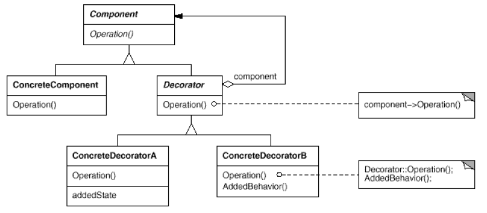
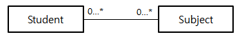
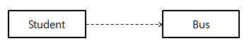
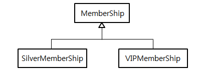
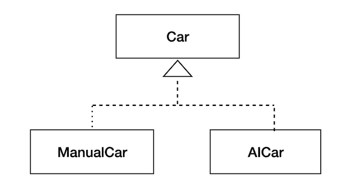

## 디자인 패턴

- 소프트웨어를 재사용할 수 있고, 유연하고, 확장성 있고, 유지보수가 용이하게 만들기 위함
- 기술, 재능, 노력, 창의성, 직관력이 필요하지만 경험이 가장 중요

- **디자인 패턴 분류**

  

**디자인 패턴은 규칙이 아님**
  - 언어에 종속적이지 않음
  - 프레임워크 개발에 적용될 수 있음
  - 특정 영역에 종속적이지 않고 일반적으로 활용가능
  - 좋은 설계에 대한 제안 

**디자인 패턴의 필요성**
  - 객체 지향을 위한 디자인 패턴은 소프트웨어의 중요한 요소를 향상시킴
    - `재사용성`, `유연성`, `확장가능성`, `유지보수성`
  - 디자인 패턴으로 의사소통 가능
  - 좋은 설계는 잘 개발된 소프트웨어와 오픈소스에 대해 학습하거나 많은 경험과 연습에 의해 훈련될 수 있음
  - 높은 결합도를 가지거나 알고리즘 종속성, 객체의 표현이나 구현에 종속적인 소프트웨어의 리팩토링을 가능하게 함
  - 좋은 설계를 유도하여 소프트웨어의 유지보수에 들어가는 비용을 절약할 수 있음

----

## 객체 지향 프로그래밍과 객체 지향 설계

**추상화**
- 어떤 영역에서 필요로 하는 속성이나 기능을 추출하는 작업
- 데이터 구조, 표현 방법에 대한 추상화
- 처리 과정에 대한 추상화

**캡슐화**
- 데이터를 감싸서 외부에서 사용 가능한 부분만을 제공(정보 은닉) - private
- 사용하는 코드(클라이언트 코드)가 세부적인 구현을 알 필요가 없음
  - 클라이언트를 위한 인터페이스 제공
- 단순한 접근을 제공하여 오류가 생길 부분을 감소
    - 객체를 보호하는 효과

**상속**
- 일반적인 개념의 객체에서 보다 **구체적**인 개념의 객체의 관계를 표현
- 상속 관계의 클래스는 상위 클래스의 타입을 내포함
- 상위 클래스의 속성과 기능을 하위 클래스에서 사용하거나 재정의
- 코드를 재사용하기 위해 상속을 사용하는 것은 위험한 생각

**다형성**
- 같은 메세지, 구현에 대해 각 객체가 다른 표현과 결과를 나타내는 것
- 클래스의 상속, 인터페이스 구현 시에 각각의 다른 구현을 가진 클래스들이 상위 타입으로 업캐스팅되고
이 때, 각 클래스에서 오버라이딩한 메서드가 존재하는 경우 같은 상위 타입으로 선언된다 하더라도 각기 다른 인스턴스의 메서드가 호출되는 것

**응집도**
- 하나의 모듈, 객체 내부의 요소들간의 연관성
- 하나의 책임을 구현하는 하나의 객체는 높은 응집도를 가짐

**결합도**
- 객체 상호간의 연관 관계
- 결합도가 높으면 하나의 객체를 수정할 때 다른 객체도 수정해야함
- 상속을 사용하는 경우 결합도가 높아짐

----

## SOLID 원칙

**단일 책임 원칙 (Single Responsibility Principle)**
    
- 하나의 클래스는 하나의 기능만을 구현한다.
- 어떤 클래스를 변경하는 이유는 **하나**여야 함
- 한 클래스에서 여러 기능을 제공하면 유지보수가 어려움

**개방 폐쇄의 원칙 (Open Closed Principle)**

- 객체 자신의 수정에 대해서는 유연하고, 다른 클래스가 수정될 때는 영향 받지 않음
- 인터페이스나 추상클래스를 통해 접근하도록 구현
- ex) Java JDBC, I/O Stream
- 여러가지 DB 솔루션의 기능을 구현하기 위해 JDBC 인터페이스를 구현 할 수 있음 

**리스코프 치환 원칙 (Liskov Substitution Principle)**

- 하위 클래스는 항상 상위 클래스로 교체될 수 있어야 함
- 상위 클래스에 제공되는 여러 기능은 하위 클래스가 모두 사용할 수 있어야 함
- IS - A 관계

**의존 역전 원칙 (Dependency Inversion Principle)**
    
- 제공하는 기능에 대한 인터페이스에만 종속적이어야함
    - 구체적 객체 (X), 추상적인 대상을 사용해야함
    - `배송` 객체가 `차량`을 필요로 할 때 `트럭`이나 `오토바이` 등을 사용하지 않아야함
- 만약 하나의 객체가 여러 기능을 제공해야 한다면 (단일 책임 원칙) 이때 클라이언트가 사용할 수 있는 여러 인터페이스를 분리하여 제공하면 
클라이언트가 사용하지 않는 기능에 종속적이지 않을 수 있음

**인터페이스 분리 원칙 (Interface Segregation Principle)**

- 의존 관계는 구체적인 것 보다는 추상적인 것에 의존함
- 구체적인 것은 이미 구현이 되어있고 변하기 쉬운 것
- 추상적인 것은 인터페이스나 추상 클래스 (상위 클래스)
- 하나의 객체가 많은 책임을 가지고 있을 경우 인터페이스로 분리시켜보기
  - 여러 기능들이 복합적으로 제공이 되는데 분리할 필요가 있는 경우

---

## 클래스 다이어그램

- 객체 지향 프로그래밍에서 여러 클래스 상호간의 협력 관계를 나타내는 다이어그램
- 클래스 간의 관계를 설계할 때 유용

 (OMG Notation)

**연관 관계 (association)**

- 클래스 상호 간에 서로 연관되어 있음을 나타냄
- 단방향 연관관계의 경우는 화살표(->)로 표시한다.
- 양방향 연관관계는 직선(-)으로 표시한다.
- 클래스간의 연관된 개체의 수를 표현해야 하는 경우에는 선의 끝쪽에 다중성(multiplicity)를 나타낸다.

```
public class Student {
	
	int studentID;
	String studentName;
    # M:N의 경우 relation 테이블을 생성하는 것이 일반적
	ArrayList<Subject> subjectList;
```



**집합 관계 (composition, aggregation)**

- 연관관계의 특별한 경우
- 클래스간의 포함관계를 나타냄
- 전체 객체와 부분 객체의 인스턴스 생존 주기( life time ) 에 따라 두가지로 구분할 수 있음

**집약 관계**

- 클래스 다이어그램에 빈 마름모로 표시
- 전체 객체와 부분 객체의 라이프 타임이 독립적 즉, 포함하는 객체(전체 객체)가 사라져도 포함된 객체 (부분 객체)는 사라지지 않음
- 공유하는 리소스가 해당됨
- 전체 객체가 생성될 때 `매개 변수`로 전달 받음
- 의존 관계와 헷갈릴 수 있는데 Life Time 위주로 집약과 합성 관계를 이해하자

**합성 관계**

- 클래스 다이어그램에 채워진 마름모로 표시
- 전체 객체의 라이프 타임에 부분객체가 종속됨. 전체 객체가 사라지면 부분 객체도 사라짐
- 주로 `멤버 변수`로 선언하여 사용
- 전체 객체의 생성자에서 부분 객체를 생성함

**의존 관계 (dependency)**

- 연관 관계 보다는 짧은 life time
- 프로그램 내에서는 참조 변수가 매개변수나 지역 변수로 구현

```
class Student {

    int money;
    ...
    public void takeBus(Bus bus) {
		  bus.take(1000);
		  this.money -= 1000;
		  
	 }
	    
	public void takeSubway(Subway subway) {
		  subway.take(1500);
		  this.money -= 1500;
	 }
}
```




**일반화 관계 (generalization)**

- 객체 지향에서 `상속`을 표현할 때
- 일반적인 클래스(상위 클래스)를 보다 구체적인 클래스(하위 클래스)가 상속함




**실체화 관계 ( realization )**

- 기능이 선언된 인터페이스를 구현하는 클래스는 선언된 기능을 구현할 책임이 있음
- 점선으로 표시
- 여러 클래스가 하나의 인터페이스를 구현함으로써 다형성을 제공함




**접근 제어자 표시**

| 접근제어자 | 표시 | 설명 |
| ------ | ------ |------ |
| public | + | 내부, 외부 모드 접근 가능 |
| protected | * | 같은 패키지나 상속관계의 클래스만 접근 가능 |
| default | ~ | 같은 패키지만 접근 가능 |
| private | - | 같은 클래스 내부에서만 접근 가능 |


