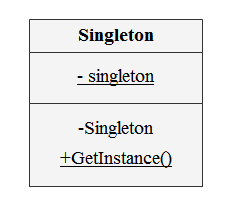
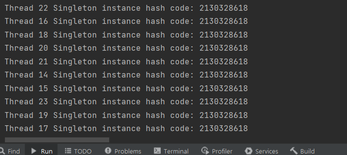

# 싱글톤 패턴

- 싱글톤 패턴은 클래스의 인스턴스를 하나의 객체로 제한하는 디자인 패턴 중 하나이다.
- 클래스의 인스턴스는 오직 하나임을 보장하며 해당 인스턴스는 전역적으로 액세스할 수 있다. (메소드 제공)
- 싱글톤 패턴은 전역 상태 또는 리소스를 여러 개체간에 공유해야 하지만 해당 리소스의 인스턴스는 오직 `하나`만 있어야 하는 상황에서 자주 사용된다.

**장점**
1. **공유 리소스에 대한 제어된 액세스**: Singleton 패턴은 공유 리소스에 대한 제어된 액세스를 허용하여 리소스의 인스턴스 하나만 생성하고 이를 필요로 하는 애플리케이션의 모든 부분에서 액세스하도록 한다.
2. **리소스의 효율적인 사용**: Singleton 패턴은 애플리케이션 전체에서 객체의 인스턴스 하나만 생성되고 사용되도록 하여 시스템 리소스를 절약하는 데 도움이 될 수 있다. 이를 통해 메모리 사용량을 줄이고 성능을 향상시킬 수 있다.
3. **전역 접근성**: 싱글톤 패턴은 객체의 단일 인스턴스에 대한 글로벌 액세스를 허용하므로 애플리케이션의 여러 부분에서 객체를 쉽게 공유하고 액세스할 수 있다.
4. **디자인 단순화**: Singleton 패턴은 애플리케이션 전체에 리소스의 여러 인스턴스를 분산시키는 대신 공유 리소스에 대한 단일 액세스 지점을 제공하여 애플리케이션 디자인을 단순화할 수 있다.
5. **캡슐화**: 싱글톤 패턴은 리소스 생성 및 관리를 캡슐화하여 코드의 복잡성을 줄이고 향후 유지 관리 및 수정을 더 쉽게 만드는 데 도움이 될 수 있다.

**단점**
1. **테스트 및 디버깅**: Singleton 패턴은 인스턴스 생성을 단일 인스턴스로 제한하므로 테스트 및 디버깅이 더 어려워질 수 있다. 예를 들어 Singleton 클래스에 다른 클래스에 대한 종속성이 있는 경우 테스트 목적으로 해당 종속성을 Mock 객체로 대체하기 어려울 수 있다.
동작을 변경하기 어렵다. 
2. **싱글톤 패턴은 클래스의 동작을 변경하기 어렵게 만들 수 있다.** Singleton 클래스를 변경하면 Singleton을 사용하는 다른 프로그램의 모든 부분에 영향을 미치므로 관리하기 어려울 수 있다.
3. **모듈성**: 싱글톤 패턴은 코드를 덜 모듈화하고 유지하기 어렵게 만든다. 예를 들어 Singleton 클래스에 많은 수의 종속성이 있는 경우 해당 코드를 더 작고 관리하기 쉬운 모듈로 리팩터링하기 어려울 수 있다.
4. **스레드 안전**: 싱글톤 패턴은 스레드로부터 안전한 방식으로 구현하기 어려울 수 있다. 여러 스레드가 동시에 Singleton에 액세스하려고 하면 경합 상태 및 기타 동기화 문제가 발생할 수 있다.
5. **전역 상태**: 싱글톤 패턴은 응용 프로그램에 전역 상태를 도입할 수 있으므로 응용 프로그램을 추론하고 디버그하기가 더 어려워질 수 있다. 전역 상태는 동시 및 병렬 코드를 작성하기 어렵게 만들 수도 있다.

**클래스 다이어그램**




**예제**

```java
public class ConnectionPool {
	
	private static ConnectionPool instance = new ConnectionPool();
	
	private ConnectionPool() {}
	
	public static ConnectionPool getInstance() {
		
		if(instance == null) {
			instance = new ConnectionPool();
		}

		return instance; 
			
	}

}

```

- ex) Calandar 클래스의 객체는 싱글톤 패턴으로 구현되어있음
```java
private static Calendar createCalendar(TimeZone zone,
                                           Locale aLocale)
    {
        CalendarProvider provider =
            LocaleProviderAdapter.getAdapter(CalendarProvider.class, aLocale)
                                 .getCalendarProvider();
        if (provider != null) {
            try {
                return provider.getInstance(zone, aLocale);
            } catch (IllegalArgumentException iae) {
                // fall back to the default instantiation
            }
        }

        Calendar cal = null;

        if (aLocale.hasExtensions()) {
            String caltype = aLocale.getUnicodeLocaleType("ca");
            if (caltype != null) {
                switch (caltype) {
                case "buddhist":
                cal = new BuddhistCalendar(zone, aLocale);
                    break;
                case "japanese":
                    cal = new JapaneseImperialCalendar(zone, aLocale);
                    break;
                case "gregory":
                    cal = new GregorianCalendar(zone, aLocale);
                    break;
                }
            }
        }
        if (cal == null) {
            // If no known calendar type is explicitly specified,
            // perform the traditional way to create a Calendar:
            // create a BuddhistCalendar for th_TH locale,
            // a JapaneseImperialCalendar for ja_JP_JP locale, or
            // a GregorianCalendar for any other locales.
            // NOTE: The language, country and variant strings are interned.
            if (aLocale.getLanguage() == "th" && aLocale.getCountry() == "TH") {
                cal = new BuddhistCalendar(zone, aLocale);
            } else if (aLocale.getVariant() == "JP" && aLocale.getLanguage() == "ja"
                       && aLocale.getCountry() == "JP") {
                cal = new JapaneseImperialCalendar(zone, aLocale);
            } else {
                cal = new GregorianCalendar(zone, aLocale);
            }
        }
        return cal;
    }


```
---

**싱글턴 패턴 동기화 이슈**

- 위의 구현에서 Singleton 패턴은 스레드로부터 안전하지 않다. 여러 스레드가 동시에 Singleton에 액세스하려고 하면 경쟁 상태 및 동기화 문제가 발생할 수 있다.
- 이 문제를 해결하기 위한 다양한 방법이 존재한다.

---

1. `synchronized` 를 사용한 방법
- 한 번에 하나의 스레드만 Singleton에 접근할 수 있도록 한다.
- 메서드를 너무 자주 호출하면 성능 문제가 발생할 수 있다.
```java
public class Singleton {
    private static Singleton instance;
    
    private Singleton () {};
    
    public static synchronized Singleton getInstance() {
        if (instance == null) {
            instance = new Singleton();
        }
        return instance;
    }
}

```

2. 즉시 초기화 사용
- 클래스가 로드될 때 Singleton 인스턴스가 생성되는 즉시 초기화를 사용한 방법이다.
- Singleton 인스턴스가 항상 필요하지 않은 경우 메모리 사용량을 증가시킬 수 있다.
```java
public class Singleton {
   private static Singleton instance = new Singleton();

   private Singleton() {}

   public static Singleton getInstance() {
      return instance;
   }
}
```

3. double-checked locking 사용
- lock을 획득하기 전에 null을 확인하고 lock을 획득한 후에 다시 확인하는 방식이다.
- getInstance() 메서드는 lock을 획득하기 전에 null을 확인(1)하고 다시 확인(2)하여 하나의 인스턴스만 생성되도록 한다.
- `volatile` 키워드는 인스턴스 변수에 대한 변경 사항이 모든 스레드에 표시되도록 한다.

```java
public class Singleton {
   private static volatile Singleton instance;

   private Singleton() {}

   public static Singleton getInstance() {
      if (instance == null) { // (1)
         synchronized (Singleton.class) { 
            if (instance == null) { // (2)
               instance = new Singleton();
            }
         }
      }
      return instance;
   }
}

```

4. 내부 클래스와 final 키워드를 사용하여 싱글톤을 구현
- `SingletonHolder`는 Singleton 인스턴스를 보유하는 내부 클래스이다. 
- INSTANCE는 final로 선언되어 한 번만 할당할 수 있으며 final 키워드로 나중에 변경할 수 없다.
- SingletonHolder 클래스는 getInstance() 메서드가 호출될 때만 로드되고 
- INSTANCE 변수는 SingletonHolder 클래스가 로드될 때 한 번만 초기화되기 때문에 스레드로부터 안전하다. 

```java
public class Singleton {
   private Singleton() {}

   private static class SingletonHolder {
      private static final Singleton INSTANCE = new Singleton();
   }

   public static Singleton getInstance() {
      return SingletonHolder.INSTANCE;
   }
}
```
---

**테스트 코드**
- Singleton 클래스의 getInstance() 메서드를 호출하는 10개의 스레드를 생성. 
- 각 스레드는 Singleton 인스턴스의 해시 코드를 출력하여 모두 동일한 인스턴스에 액세스하고 있는지 확인한다.

```java
public class SingletonTest {
   public static void main(String[] args) {

      for (int i = 0; i < 10; i++) {
         Thread thread = new Thread(new Runnable() {
            public void run() {
               Singleton singleton = Singleton.getInstance();
               System.out.println("Thread " + Thread.currentThread().getId() + " Singleton instance hash code: " + singleton.hashCode());
            }
         });
         thread.start();
      }
   }
}
```

**결과**
- 모든 스레드가 동일한 Singleton 인스턴스에 액세스하고 있음



**참고**
https://m.blog.naver.com/sun_zero2/222080290099


